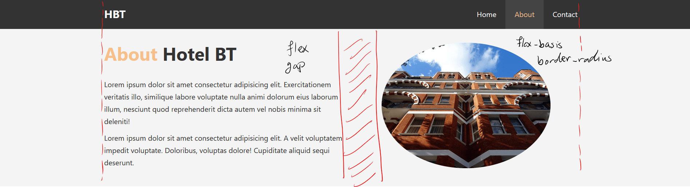
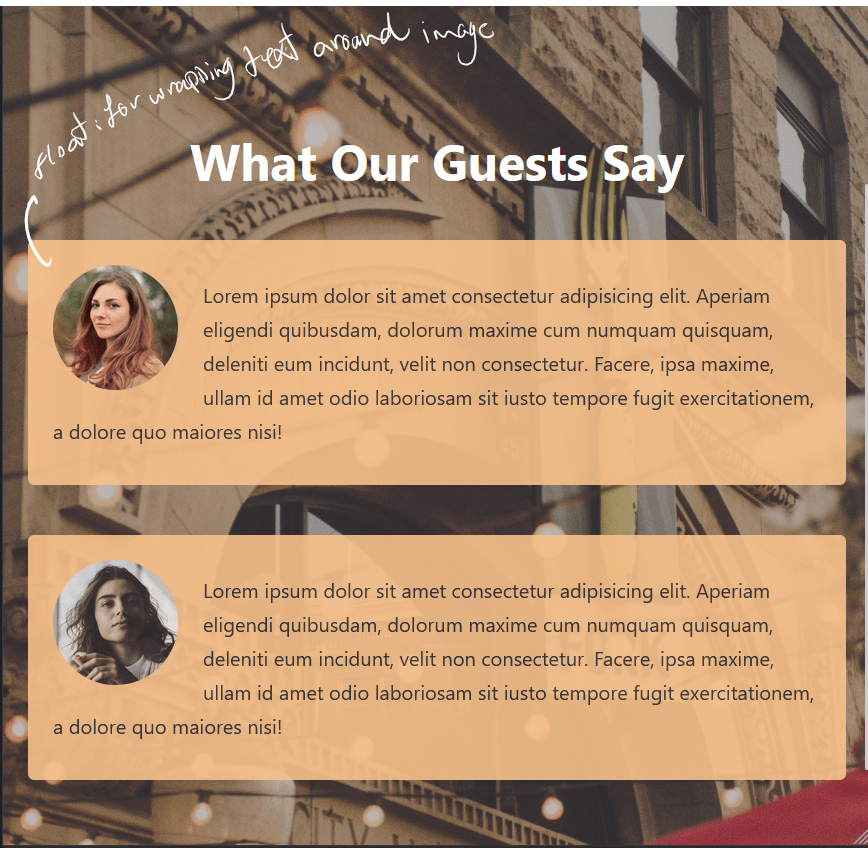

# 🖥️ Project Title: Responsive HBT Hotel Site

## 🧠 Project Overview

This is a self-teaching project aimed at solidifying my understanding of the fundamentals of responsive design through a simple hotel layout.

### 🎯 Learning Goals

- Work with image backgrounds and the `` HTML element  
- Understand and use CSS Floats  
- Master Flexbox  
- Implement responsive design principles  
- Use CSS variables effectively  
- Write cleaner code by generalizing styles  

---

## 🗺️ Workflow: From Design to Code

### 🎨 Design Phase

Before coding, I reviewed the design to identify layout structures and style patterns. The goal was to minimize code repetition by applying reusable styles.

**Layout and Component Breakdown:**

  
  
  
  
---  
  
  
---  

---

### 🧰 Utilities and Layout Strategies

**Utilities:**

- `ba-accent`: Used for cards and testimonials  
- `text-accent`: Used for headings  
- `bg-dark`:  
  - section: white text on black background  
  - Button: black text on white background  
- `background-img`: Used for three different background images with similar properties; only the URL differs (leveraging CSS variables)

**Layout Classes:**

- `split`:  
  - Sets `display: flex`  
  - Adds `gap` using `var(--gap, 0)`  
  - Makes it easier to handle responsive column layout with a single media query  

- `split-evenly`:  
  - Used for cards and the about section  
  - Applies `flex-grow` to all children for even distribution  

- `flow > * + *`:  
  - Adds a 30px gap between sibling elements  

---

### 📚 Design Source

This project is part of the **Traversy Media HTML & CSS Course**.

### ⚙️ Planning & Setup
- Folder structure
- Tools, frameworks, or libraries chosen
- Dev environment setup

### 🧑‍💻 Development Process
- HTML structure creation
- Styling components
- Interactivity and JavaScript
- Responsive design handling
- Deployment process

---

## 🔍 Decoding Concepts (Explain Your Decisions)

A space to explain your technical decisions:
- Why certain layout techniques were used
- Component structure rationale
- CSS/JS/Framework choices
- Trade-offs and alternatives considered

---

## 🧱 Problems & Solutions

### Problem #1
**Issue:**  
**Cause (if known):**  
**Solution:**  
**Lesson Learned:**

### Problem #2
...

---

## 💡 Things I’d Do Differently

Reflections on what could be improved:
- Code organization
- Better tools or libraries
- UX or performance issues

---

## 📚 Resources & Notes

- [Helpful article or doc #1](#)
- [Helpful article or doc #2](#)
- Notes or definitions of key concepts

---

## 🚀 Final Result

- **Live Demo:** [Link Here]
- **Screenshots:**  
  

- **Source Code:** [GitHub Repository](#)

---

